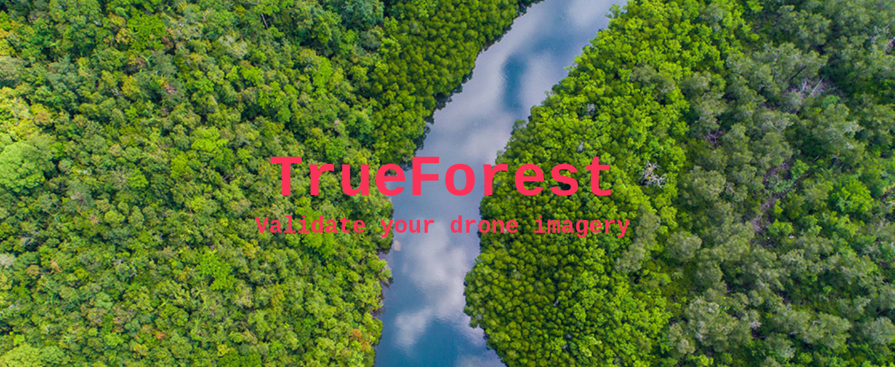

Welcome!

This is the Git Repository of Sven Kohler containing the code to reproduce the data and experimental results for my Master's thesis _Towards Trusted Self-Reports With Foundational Models_.

## Directory Structure

```
├── API
│   ├── static
│   ├── templates
│   ├── main.py
│   ├── SimCLR.py
│   └── utils.py
├── configs
│   ├── config_BarlowTwins.yaml
│   ├── ...
│   └── custom.yaml
├── GEE
│   ├── NAIP_extraction.py
│   ├── Sentinel_extraction.py
│   ├── process_data.py
│   └── tif_to_png.py
├── models
│   ├── BarlowTwins.py
│   ├── ...
│   ├── MetricLearning.py
│   ├── load_model.py
│   ├── model_trainer.py
│   └── model_tester.py
├── main.py
└── utils.py

```

Some notes:

1. **API**: this folder contains the code for the online application to verify drone imagery. The API is implemented using FastAPI. Please visit the website under: www.TBD.org
2. **configs**: find here the configuration files to reproduce the experimental results. There exists an individual file for each SSL architecture.
3. **GEE**: Contents of this folder are for extracting Sentinel/NAIP imagery in TIF format from Google Earth Engine (GEE) and then subsequently processing it into patches of the preferred size in PNG format.
4. **models**: This folder contains code for the SSL architectures aswell as code for training/testing and loading the desired model.

## Getting started

**1) Requirements**

Preferably, create your own conda environment before following the step below:

```
pip3 install -r requirements.txt
```

**2) Setup paths and data folder**

Next, update the path variables under `utils.py` in the paths_setter() function:

```
def paths_setter(hostname, config):
    '''
    helper function to set correct paths dependent on which host machine the code is run.
    Customize here if necessary.

    '''

    if hostname == 'a':
        config.data_store = "please insert path to data folder here"
        config.dump_path = "please enter path to dump location here" + "/dump_" + config.experiment_name

    elif hostname == 'b':
        config.data_store = "please insert path to data folder here"
        config.dump_path = "please enter path to dump location here" + "/dump_" + config.experiment_name

    else:
        config.data_store = "please insert path to data folder here"
        config.dump_path = "please enter path to dump location here" + "/dump_" + config.experiment_name
```

Then create a datafolder expanding the above folder structure according to your need in the following way:

```
├── data
│   └── raw
│       └── NAIP
│           │── location A
│           │── ...
│           └── location Z
│               └── train
│               └── test
        └── Sentinel
│           │── location A
│           │── ...
│           └── location Z
│               └── train
│               └── test
```

**3) Download Data**

Use the files `GEE/NAIP_extraction.py` and `GEE/sentinel_extraction.py` to get the desired imagery downloaded onto your Google Drive. Now assign downloaded imagery to the data folder created in the previous step. Next, run `GEE/process_data.py` to convert the raw TIF files into PNG files of the proper dimensions.

## Training encoder

```
python3 main.py --config config_custom --run_mode train_encoder --batch_size 256 --patch_size 224
```

## Binary classification
