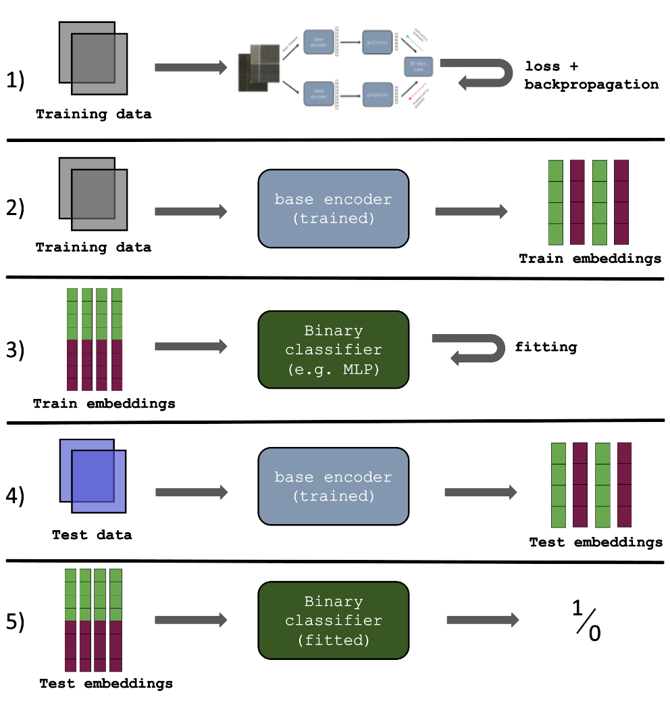

Welcome!

This is the Git Repository of Sven Kohler containing the code to reproduce the data and experimental results for my Master's thesis _Towards Trusted Self-Reports With Foundational Models_.

## Directory Structure

```
├── API
│   ├── static
│   ├── templates
│   ├── main.py
│   ├── SimCLR.py
│   └── utils.py
├── configs
│   ├── config_BarlowTwins.yaml
│   ├── ...
│   └── custom.yaml
├── GEE
│   ├── NAIP_extraction.py
│   ├── Sentinel_extraction.py
│   ├── process_data.py
│   └── tif_to_png.py
├── models
│   ├── BarlowTwins.py
│   ├── ...
│   ├── MetricLearning.py
│   ├── load_model.py
│   ├── model_trainer.py
│   └── model_tester.py
├── main.py
└── utils.py

```

Some notes:

1. **API**: this folder contains the code for the online application to verify drone imagery. The API is implemented using FastAPI. Please visit the website under: www.TBD.org
2. **configs**: find here the configuration files to reproduce the experimental results. There exists an individual file for each SSL architecture.
3. **GEE**: Contents of this folder are for extracting Sentinel/NAIP imagery in TIF format from Google Earth Engine (GEE) and then subsequently processing it into patches of the preferred size in PNG format.
4. **models**: This folder contains code for the SSL architectures aswell as code for training/testing and loading the desired model.

## Getting started

**1) Requirements**

Preferably, create your own conda environment before following the step below:

```
pip3 install -r requirements.txt
```

**2) Setup paths and data folder**

Next, update the path variables under `utils.py` in the paths_setter() function:

```
def paths_setter(hostname, config):
    '''
    helper function to set correct paths dependent on which host machine the code is run.
    Customize here if necessary.

    '''

    if hostname == 'a':
        config.data_store = "please insert path to data folder here"
        config.dump_path = "please enter path to dump location here" + "/dump_" + config.experiment_name

    elif hostname == 'b':
        config.data_store = "please insert path to data folder here"
        config.dump_path = "please enter path to dump location here" + "/dump_" + config.experiment_name

    else:
        config.data_store = "please insert path to data folder here"
        config.dump_path = "please enter path to dump location here" + "/dump_" + config.experiment_name
```

Then create a datafolder expanding the above folder structure according to your need in the following way:

```
├── data
│   └── raw
│       └── NAIP
│           │── location A
│           │── ...
│           └── location Z
│               └── train
│                   └── patch_size 1
│                   └── ...
│                   └── patch_size x
│               └── test
│                   └── patch_size 1
│                   └── ...
│                   └── patch_size x
│       └── Sentinel
│           │── location A
│           │── ...
│           └── location Z
│               └── train
│                   └── patch_size 1
│                   └── ...
│                   └── patch_size x
│               └── test
│                   └── patch_size 1
│                   └── ...
│                   └── patch_size x
```

**3) Download Data**

Use the files `GEE/NAIP_extraction.py` and `GEE/sentinel_extraction.py` to get the desired imagery downloaded onto your Google Drive. Now assign downloaded imagery to the data folder created in the previous step. Next, run `GEE/process_data.py` to convert the raw TIF files into PNG files of the proper dimensions. Example below:

```
python3 process_data.py --patch_size 224 --data_type train --location Central_Valley
```

## End-to-end training and testing pipeline

Have a look at the image below to get a sense of the training and testing pipeline.



Step 1) (training the encoder) can be performed by executing the following command in the terminal. Specify the SSL architecture in `custom.yaml` or choose a predefined configuration file.

```
python3 main.py --config custom --run_mode train_encoder --batch_size 256 --patch_size 224
```

Step 2)-5) (creating embeddings, training classifier, prediction) are jointly performed by this command

```
python3 main.py --config custom --run_mode test_mult --patch_size 224 --clf MLP
```

## Configuration files

To reproduce the scores presented in our report the interested user will mainly interact with the configuration files under `configs/`. Below you find a detailed list of available settings,flags, and variables:

- seed [int]: To reproduce results, select seed for all random processes.
- run_mode [str]: choices below
  - train_encoder: choose this mode to train the elected SSL architecture and save the weights in your dump path.
  - test_mult: chose this mode to create embeddings, train the chosen classifier and predict on test data. This will be repeated for a given number of iterations. At each iteration the model accuracy is recorded.
  - train_classifier: this mode is specifically for training a single classifier for later implementation in the web-based verification system.
- patch_size [int]: Refers to the edge length of the images the model will be trained on. Available sizes are determined by the previously created data (see data folder structure).
- location [List[str]]:
